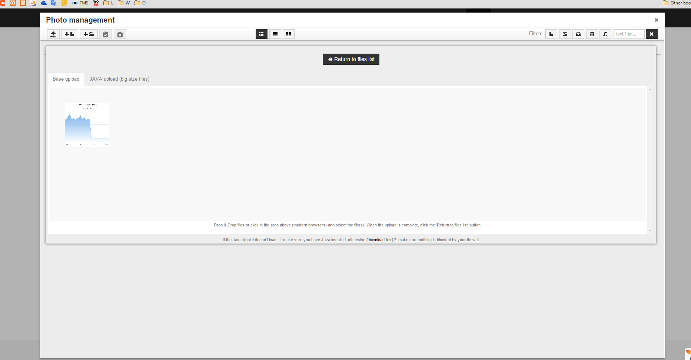

# yii2-media 
This is simple extension use both tinymce and response file manager
#### Usage :
1. Download, config and copy Response Filmanager to public folder (you can download here : http://www.responsivefilemanager.com/
2. <br />
```
composer require "ivoglent/yii2-media":"dev-master"
```
In the view file :
```php
echo \ivoglent\yii2\media\MediaEditor::widget([
        'name'=>'a',
        'fileManagerUrl'=> \yii\helpers\BaseUrl::base(true) .'/rfm/' //This is my responsive filemanager URL
    ]);
```


Note : Be careful with Response Filemanager config for security reasons.


Screenshot :

